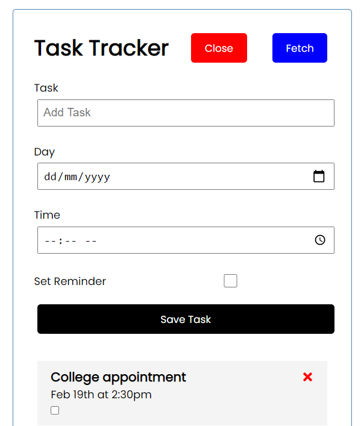

# Task Tracker (Travesty Task Tracker Clone) - NodeJS | Express | PostgreSQL | ReactJS



This is a fullstack app. The frontend is built using ReactJS (Functional Component) and backend was built using ExpressJS.

## Tech
* PostgreSQL
* Express
* ReactJS
* Node
* REST

## Tech
* WebPack
* Babel
* HandleBars
* Node

## Installation

```
$ npm install
$ service postgresql start
$ npm run build
$ npm start

```

## License
[MIT](https://choosealicense.com/licenses/mit/)